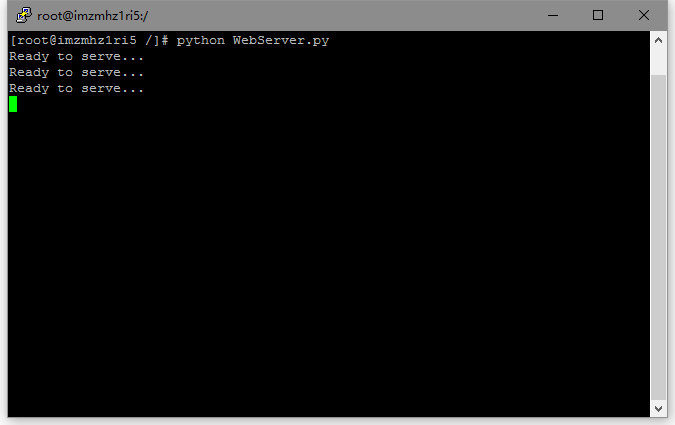
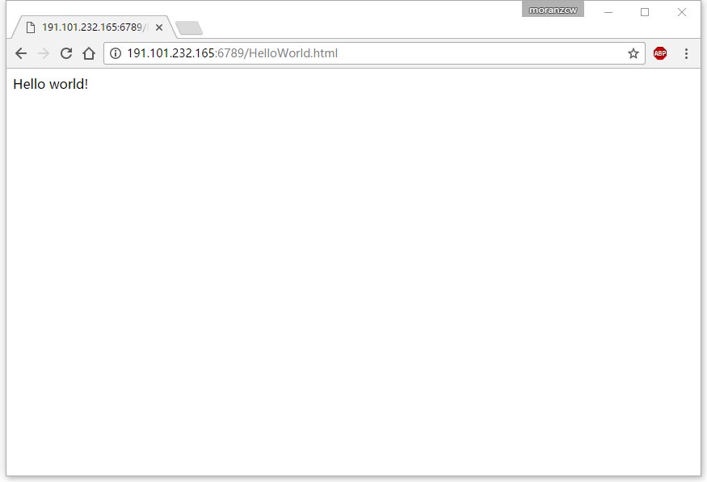
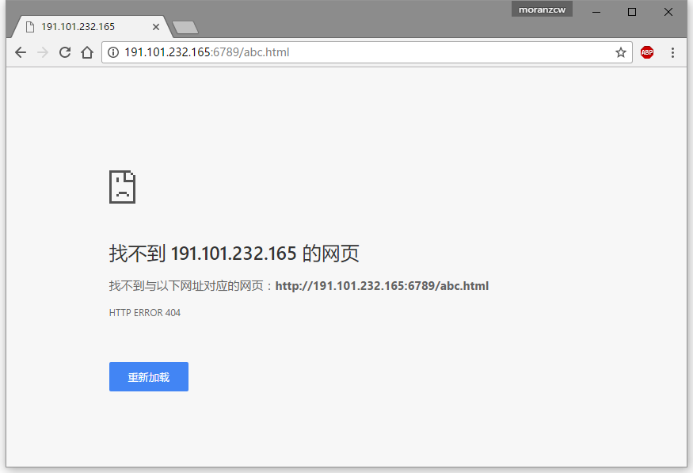

# 编程作业1：Web服务器（解答）

## 作业描述

《计算机网络：自顶向下方法》中第二章末尾给出了此编程作业的简单描述：

> 在这个编程作业中，你将用Python语言开发一个简单的Web服务器，它仅能处理一个请求。具体而言，你的Web服务器将：
> 1. 当一个客户（浏览器）联系时创建一个连接套接字；
> 2. 从这个连接套接字接收HTTP请求；
> 3. 解释该请求以确定所请求的特定文件；
> 4. 从服务器的文件系统获得请求的文件；
> 5. 创建一个由请求的文件组成的HTTP响应报文，报文前面有首部行；
> 6. 经TCP连接向请求浏览器发送响应。如果浏览器请求一个在该服务器种不存在的文件，服务器应当返回一个“404 Not Found”差错报文。  
>
> 在配套网站中，我们提供了用于该服务器的框架代码，我们提供了用于该服务器的框架代码。你的任务是完善该代码，运行服务器，通过在不同主机上运行的浏览器发送请求来测试该服务器。如果运行你服务器的主机上已经有一个Web服务器在运行，你应当为该服务器使用一个不同于80端口的其他端口。

## 详细描述

**见官方文档：[Socket1_WebServer.pdf](Socket1_WebServer.pdf)**

**以及笔者翻译：[编程作业1-Web服务器(中文文档).md](编程作业1-Web服务器(中文文档).md)**


## 代码

官方给出的代码基于python 2，以下使用python 3，修改了一些细节以处理字符编码问题。

这段代码的功能是：建立一个只允许一个连接的服务器，在指定端口监听客户端的请求，从客户端发送的请求中提取文件名，若该文件存在于服务器上（如下文的"HelloWorld.html"），则生成一个状态码200的POST报文，并返回该文件；若该文件不存在，则返回一个404 Not Found报文。

**WebServer.py**

``` python
#import socket module
from socket import *
serverSocket = socket(AF_INET, SOCK_STREAM) 
#Prepare a sever socket 
serverSocket.bind(('', 6789)) # 将TCP欢迎套接字绑定到指定端口
serverSocket.listen(1) # 最大连接数为1

while True:
	#Establish the connection
	print('Ready to serve...')
	connectionSocket, addr = serverSocket.accept() # 接收到客户连接请求后，建立新的TCP连接套接字
	try:
		message = connectionSocket.recv(1024) # 获取客户发送的报文
		filename = message.split()[1]
		f = open(filename[1:])
		outputdata = f.read();
		#Send one HTTP header line into socket
		header = ' HTTP/1.1 200 OK\nConnection: close\nContent-Type: text/html\nContent-Length: %d\n\n' % (len(outputdata))
		connectionSocket.send(header.encode())

		#Send the content of the requested file to the client
		for i in range(0, len(outputdata)):
			connectionSocket.send(outputdata[i].encode())
		connectionSocket.close()
	except IOError:
		#Send response message for file not found
		header = ' HTTP/1.1 404 Found'
		connectionSocket.send(header.encode())
		
		#Close client socket
		connectionSocket.close()
serverSocket.close()
```

**HelloWorld.html**

```html
<head>Hello world!</head>
```

**代码文件**

[WebServer.py](source/WebServer.py)

[HelloWorld.html](source/HelloWorld.html)

## 运行

**服务器端：**

在一台主机上的同一目录下放入`WebServer.py`和`HelloWorld.html`两个文件，并运行`WebServer.py`，作为服务器。



**客户端：**

在另一台主机上打开浏览器，并输入"http://XXX.XXX.XXX.XXX:6789/HelloWorld.html" （其中"XXX.XXX.XXX.XXX"是服务器IP地址），以获取服务器上的`HelloWorld.html`文件。

一切正常的话，可以看到如下页面：



输入新地址"http://XXX.XXX.XXX.XXX:6789/abc.html"，以获取服务器上不存在的`abc.html`。

将出现以下页面（注意页面中的"HTTP ERROR 404"）：

