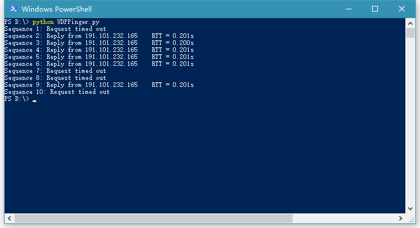

# 套接字编程作业2：UDPping程序

## 作业描述

《计算机网络：自顶向下方法》中第二章末尾给出了此编程作业的简单描述：

> 在这个编程作业中，你将用Python编写一个客户ping程序。该客户将发送一个简单的ping报文，接受一个从服务器返回的pong报文，并确定从该客户发送ping报文到接收到pong报文为止的时延。该时延称为往返时延（RTT）。由该客户和服务器提供的功能类似于在现代操作系统中可用的标准ping程序，然而，标准的ping使用互联网控制报文协议（ICMP）（我们将在第4章中学习ICMP）。此时我们将创建一个非标准（但简单）的基于UDP的ping程序。
>
> 你的ping程序经UDP向目标服务器发送10个ping报文，对于每个报文，当对应的pong报文返回时，你的客户要确定和打印RTT。因为UDP是一个不可靠协议，由客户发送的分组可能会丢失。为此，客户不能无限期地等待对ping报文的回答。客户等待服务器回答的时间至多为1秒；如果没有收到回答，客户假定该分组丢失并相应地打印一条报文。
>
> 在此作业中，我们给出服务器的完整代码（在配套网站中可以找到。你的任务是编写客户代码，该代码与服务器代码非常类似。建议你先仔细学习服务器的代码，然后编写你的客户代码，可以不受限制地从服务器代码中剪贴代码行。

## 详细描述

**官方文档：[Socket2_UDPpinger.pdf](Socket2_UDPpinger.pdf)**

**翻译：[编程作业2-UDPping程序-中文文档.md](编程作业2-UDPping程序-中文文档.md)**

## 实现

读懂文档给出的Ping程序服务器端代码后，可已很容易的写出Ping程序。首先建立一个UDP套接字，并指定目的IP地址和端口。随之使用一个循环来发送数据包，共循环10次。其中每次在发送前从系统提取一次时间，接收到服务器返回的消息后 ，再提取一次时间，两次相减，即可得到每个消息的往返时延（RTT）。

## 代码
**UDPPinger.py**

```python
from socket import *
import time

serverName = '191.101.232.165' # 服务器地址，本例中使用一台远程主机
serverPort = 12000 # 服务器指定的端口
clientSocket = socket(AF_INET, SOCK_DGRAM) # 创建UDP套接字，使用IPv4协议
clientSocket.settimeout(1) # 设置套接字超时值1秒

for i in range(0, 10):
	sendTime = time.time()
	message = ('Ping %d %s' % (i+1, sendTime)).encode() # 生成数据报，编码为bytes以便发送
	try:
		clientSocket.sendto(message, (serverName, serverPort)) # 将信息发送到服务器
		modifiedMessage, serverAddress = clientSocket.recvfrom(1024) # 从服务器接收信息，同时也能得到服务器地址
		rtt = time.time() - sendTime # 计算往返时间
		print('Sequence %d: Reply from %s    RTT = %.3fs' % (i+1, serverName, rtt)) # 显示信息
	except Exception as e:
		print('Sequence %d: Request timed out' % (i+1))
		
clientSocket.close() # 关闭套接字
```

**UDPPingerServer.py**

```python
# UDPPingerServer.py
# We will need the following module to generate randomized lost packets import random
from socket import *
import random

# Create a UDP socket
# Notice the use of SOCK_DGRAM for UDP packets
serverSocket = socket(AF_INET, SOCK_DGRAM)
# Assign IP address and port number to socket
serverSocket.bind(('', 12000))

while True:
	# Generate random number in the range of 0 to 10
	rand = random.randint(0, 10)
	# Receive the client packet along with the address it is coming from
	message, address = serverSocket.recvfrom(1024)
	# Capitalize the message from the client
	message = message.upper()
	# If rand is less is than 4, we consider the packet lost and do not respond
	if rand < 4:
		continue
	# Otherwise, the server responds
	serverSocket.sendto(message, address)
```

**代码文件**

[UDPPinger.py](source/UDPPinger.py)

[UDPPingerServer.py](source/UDPPingerServer.py)

## 运行

**服务器端：**

在一台主机上运行`UDPPingerServer.py`，作为接收ping程序数据的服务器。

效果如下：


**客户端：**

在另一台主机上运行`UDPPinger.py`，效果如下：

