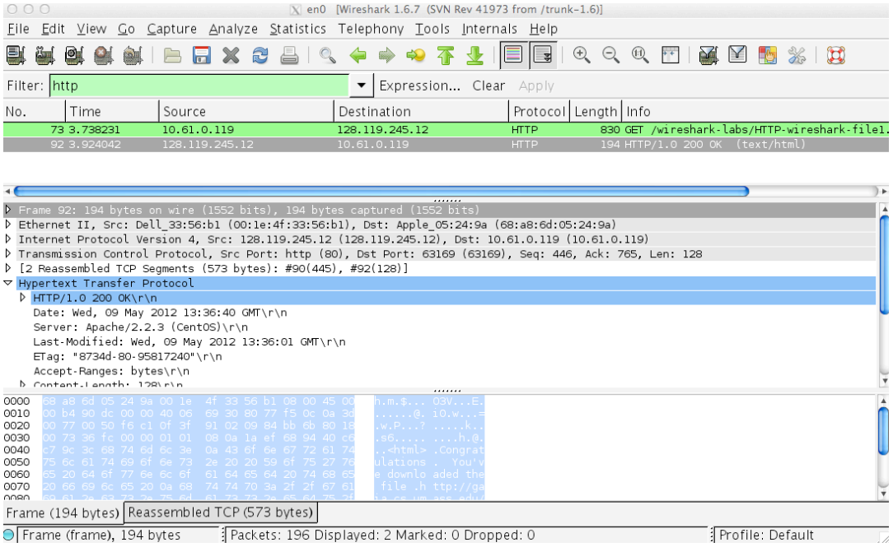

# Wireshark实验 - HTTP

**官方英文文档：[Wireshark_Intro_v7.0.pdf](Wireshark_Intro_v7.0.pdf)**  

**以下内容为笔者翻译：**

------

## Wireshark 实验:  HTTP v7.0

***《计算机网络：自顶向下方法（第七版）》*补充材料，J.F. Kurose and K.W. Ross**

“不闻不若闻之，闻之不若见之，见之不若知之，知之不若行之。” ——中国谚语 

© 2005-2016, J.F Kurose and K.W. Ross, All Rights Reserved

***

在介Wireshark实验-入门里，我们已经初步使用了Wireshark包嗅探器，我们现在可以操作Wireshark来查看网络协议。在这个实验中，我们会探索HTTP协议的几个方面：基本的GET/response交互，HTTP消息格式，检索大型HTML文件，检索具有嵌入对象的HTML文件，HTTP认证和安全性。在开始这些实验之前，您可能想查看书中第2.2节。

### 1.基本HTTP GET/response交互

我们开始探索HTTP，方法是下载一个非常简单的HTML文件
非常短，并且不包含嵌入的对象。执行以下操作：

1. 启动您的浏览器。
2. 启动Wireshark数据包嗅探器，如Wireshark实验-入门所述（还没开始数据包捕获）。在display-filter-specification窗口中输入“http”（只是字母，不含引号标记），这样就在稍后的分组列表窗口中只捕获HTTP消息。（我们只对HTTP协议感兴趣，不想看到其他所有的混乱的数据包）。

3. 稍等一会儿（我们将会明白为什么不久），然后开始Wireshark数据包捕获。

4. 在浏览器中输入以下内容 http://gaia.cs.umass.edu/wireshark-labs/HTTP-wireshark-file1.html 您的浏览器应显示非常简单的单行HTML文件。

5. 停止Wireshark数据包捕获。

你的Wireshark窗口应该类似于图1所示的窗口。如果你无法连接网络并运行Wireshark，您可以根据后面的步骤下载已捕获的数据包：

下载zip文件 http://gaia.cs.umass.edu/wireshark-labs/wireshark-traces.zip 

解压缩文件 http-ethereal-trace-1。这个zip文件中的数据是由本书作者之一使用Wireshark在作者电脑上收集的，并且是按照Wireshark实验中的步骤做的。 如果你下载了数据文件，你可以将其加载到Wireshark中，并使用文件菜单选择打开并查看数据，然后选择http-ethereal-trace-1文件。 结果显示应与图1类似。（在不同的操作系统上，或不同的Wireshark版本上，Wireshark的界面会不同）。

**图1：Wireshark显示 http://gaia.cs.umass.edu/wireshark-labs/HTTPwireshark-file1.html 已被您的浏览器打开**

图1中的示例在分组列表窗口中显示了两个被捕获的HTTP消息：GET消息（从您的浏览器发送到gaia.cs.umass.edu 的web服务器）和从服务器到浏览器的响应消息。分组内容窗口显示所选消息的详细信息（在这种情况下为HTTP OK消息，其在分组列表窗口中高亮显示）。回想一下，因为HTTP消息被装载在TCP报文段内，该报文段是在IP分组封装吗，进而在以太网帧，和帧中封装，所以界面中显示了帧，以太网，IP，TCP分组信息以及HTTP报文信息。我们想最小化非HTTP数据的显示（我们这里只对HTTP感兴趣，这些其他协议将在以后的实验中研究），所以确保帧，以太网，IP和TCP行的信息被隐藏，注意左边有一个加号或一个向右的三角形（这意味着有信息被隐藏），而HTTP行具有减号或向下三角形（表示显示有关HTTP消息的所有信息）。

（注意：您应该忽略与favicon.ico相关的任何HTTP GET和response。 如果你看到一个关于这个文件的引用，这是你的浏览器自动询问服务器是否有一个图标文件应显示在浏览器的URL旁边。 我们会忽略这个引起麻烦的引用。）

通过查看HTTP GET和响应消息中的信息，回答以下问题。 在回答以下问题时，您应该打印出GET和响应消息（请参阅Wireshark-入门实验以获取信息），并指出您在消息中的哪个具体位置找到了回答以下问题的信息。 当您上交作业时，请注明输出，显示您在哪些地方表示了您的答案（例如，对于我们的课程，我们要求学生用笔标记纸质副本，或用彩色字体在电子副本的中注释文本）。

1. 您的浏览器是否运行HTTP版本1.0或1.1？服务器运行什么版本的HTTP？
2. 您的浏览器会从接服务器接受哪种语言（如果有的话）？
3. 您的计算机的IP地址是什么？ gaia.cs.umass.edu服务器地址呢？
4. 服务器返回到浏览器的状态代码是什么？
5. 服务器上HTML文件的最近一次修改是什么时候？
6. 服务器返回多少字节的内容到您的浏览器？
7. 通过检查数据包内容窗口中的原始数据，你是否看到有协议头在数据包列表窗口中未显示？ 如果是，请举一个例子。

在您对上述问题5的回答中，您可能会惊讶地发现您刚才检索的文档在下载文档之前最近一次修改是一分钟前。 那是因为（对于这个特定文件），gaia.cs.umass.edu服务器将文件的最后修改时间设置为当前时间，并且每分钟执行一次。 因此，如果您在两次访问之间等待一分钟，则该文件看起来已被修改，因此您的浏览器将下载文档的“新”副本。

### 2.HTTP条件Get/response交互

回顾书的第2.2.5节，大多数Web浏览器使用对象缓存，从而在检索HTTP对象时执行条件GET。执行以下步骤之前，请确保浏览器的缓存为空。（要在Firefox下执行此操作，请选择“工具” - > “清除最近历史记录”，然后检查缓存框，对于Internet Explorer，选择“工具” - >“Internet选项” - >“删除文件”；这些操作将从浏览器缓存中删除缓存文件。 现在按下列步骤操作：

* 启动您的浏览器，并确保您的浏览器的缓存被清除，如上所述。
* 启动Wireshark数据包嗅探器。
* 在浏览器中输入以下URL http://gaia.cs.umass.edu/wireshark-labs/HTTP-wireshark-file2.html 您的浏览器应显示一个非常简单的五行HTML文件。
* 再次快速地将相同的URL输入到浏览器中（或者只需在浏览器中点击刷新按钮）。
* 停止Wireshark数据包捕获，并在display-filter-specification窗口中输入“http”，以便只捕获HTTP消息，并在数据包列表窗口中显示。
* （注意：如果无法连接网络并运行Wireshark，则可以使用http-ethereal-trace-2数据包跟踪来回答以下问题；请参见上文注释。）

回答下列问题：

8. 检查第一个从您浏览器到服务器的HTTP GET请求的内容。您在HTTP GET中看到了“IF-MODIFIED-SINCE”行吗？

9. 检查服务器响应的内容。服务器是否显式返回文件的内容？ 你是怎么知道的？

10. 现在，检查第二个HTTP GET请求的内容。 您在HTTP GET中看到了“IF-MODIFIED-SINCE:”行吗？ 如果是，“IF-MODIFIED-SINCE:”头后面包含哪些信息？

11. 针对第二个HTTP GET，从服务器响应的HTTP状态码和短语是什么？服务器是否明确地返回文件的内容？请解释。

### 3.检索长文件

在我们到目前为止的例子中，检索的文档是简短的HTML文件。 接下来我们来看看当我们下载一个长的HTML文件时会发生什么。 按以下步骤操作：

* 启动您的浏览器，并确保您的浏览器缓存被清除，如上所述。
* 启动Wireshark数据包嗅探器
* 在您的浏览器中输入以下URL http://gaia.cs.umass.edu/wireshark-labs/HTTP-wireshark-file3.html 您的浏览器应显示相当冗长的美国权利法案。
* 停止Wireshark数据包捕获，并在display-filter-specification窗口中输入“http”，以便只显示捕获的HTTP消息。
* （注意：如果无法连接网络并运行Wireshark，则可以使用http-ethereal-trace-3数据包跟踪来回答以下问题；请参见上文注释。）

在分组列表窗口中，您应该看到您的HTTP GET消息，然后是对您的HTTP GET请求的多个分组的TCP响应。这个多分组响应值得进行一点解释。回顾第2.2节（见文中的图2.9），HTTP响应消息由状态行组成，后跟标题行，后跟一个空行，后跟实体主体。在我们的HTTP GET这种情况下，响应中的实体主体是整个请求的HTML文件。在我们的例子中，HTML文件相当长，4500字节太大，一个TCP数据包不能容纳。因此，单个HTTP响应消息由TCP分成几个部分，每个部分包含在单独的TCP报文段中（参见书中的图1.24）。在Wireshark的最新版本中，Wireshark将每个TCP报文段指定为独立的数据包，并且单个HTTP响应在多个TCP数据包之间分段的事实由Wireshark显示的Info列中的“重组PDU的TCP段”指示。 Wireshark的早期版本使用“继续”短语表示HTTP消息的整个内容被多个TCP段打断。我们在这里强调，HTTP中没有“继续”消息！

回答下列问题：

12. 您的浏览器发送多少HTTP GET请求消息？哪个数据包包含了美国权利法案的消息？
13. 哪个数据包包含响应HTTP GET请求的状态码和短语？
14. 响应中的状态码和短语是什么？
15. 需要多少包含数据的TCP段来执行单个HTTP响应和权利法案文本？

### 4.具有嵌入对象的HTML文档

现在我们已经看到Wireshark如何显示捕获的大型HTML文件的数据包流量，我们可以看看当浏览器使用嵌入的对象下载文件时，会发生什么，即包含其他对象的文件（在下面的例子中是图像文件） 的服务器。
执行以下操作：

- 启动您的浏览器。
- 启动Wireshark数据包嗅探器。
- 在浏览器中输入以下URL http://gaia.cs.umass.edu/wireshark-labs/HTTP-wireshark-file4.html 您的浏览器应显示包含两个图像的短HTML文件。这两个图像在基本HTML文件中被引用。也就是说，图像本身不包含在HTML文件中；相反，图像的URL包含在已下载的HTML文件中。如书中所述，您的浏览器将不得不从指定的网站中检索这些图标。我们的出版社的图标是从gaia.cs.umass.edu网站检索的。而我们第5版（我们最喜欢的封面之一）的封面图像存储在caite.cs.umass.edu服务器（这是cs.umass.edu中的两个不同的Web服务器）。
- 停止Wireshark数据包捕获，并在display-filter-specification窗口中输入“http”，以便只显示捕获的HTTP消息。
- （注意：如果无法连接网络并运行Wireshark，则可以使用http-ethereal-trace-4数据包跟踪来回答以下问题；请参见上文注释。）

回答下列问题：

16. 您的浏览器发送了几个HTTP GET请求消息？ 这些GET请求发送到哪个IP地址？
17. 浏览器从两个网站串行还是并行下载了两张图片？请说明。

### 5.HTTP认证

最后，我们尝试访问受密码保护的网站，并检查网站的HTTP消息交换的序列。URL http://gaia.cs.umass.edu/wireshark-labs/protected_pages/HTTP-wireshark-file5.html 是受密码保护的。用户名是“wireshark-students”（不包含引号），密码是“network”（再次不包含引号）。所以让我们访问这个“安全的”受密码保护的网站。执行以下操作：

* 请确保浏览器的缓存被清除，如上所述，然后关闭你的浏览器，再然后启动浏览器
* 启动Wireshark数据包嗅探器。
* 在浏览器中输入以下URL http://gaia.cs.umass.edu/wireshark-labs/protected_pages/HTTP-wiresharkfile5.html 在弹出框中键入所请求的用户名和密码。
* 停止Wireshark数据包捕获，并在display-filter-specification窗口中输入“http”，以便只显示捕获的HTTP消息。
* （注意：如果无法连接网络并运行Wireshark，则可以使用http-ethereal-trace-5数据包跟踪来回答以下问题；请参见上文注释。）

现在来看看Wireshark输出。 您可能需要首先阅读HTTP身份验证相关信息，方法是在 http://frontier.userland.com/stories/storyReader$2159 上查看“HTTP Access Authentication Framework ”上的易读材料。

回答下列问题：

18. 对于您的浏览器的初始HTTP GET消息，服务器响应（状态码和短语）是什么响应？
19. 当您的浏览器第二次发送HTTP GET消息时，HTTP GET消息中包含哪些新字段？

您输入的用户名（wireshark-students）和密码（network）按照客户端HTTP GET消息中请求头的“Authorization: Basic ”的字符串（d2lyZXNoYXJrLXN0dWRlbnRzOm5ldHdvcms=）编码。虽然您的用户名和密码可能加密，但它们只是以一种称为Base64格式的格式进行编码。用户名和密码并没有加密！要确认这些，请访问 http://www.motobit.com/util/base64-decoder-encoder.asp 并输入base64编码的字符串d2lyZXNoYXJrLXN0dWRlbnRz 并进行解码。瞧！您已从Base64编码转换为ASCII编码，因此应该看到您的用户名！要查看密码，请输入字符串Om5ldHdvcms=的剩余部分，然后按解码。因为任何人都可以下载像Wireshark这样的工具，而且可以通过网络适配器嗅探数据包（不仅仅是自己的），任何人都可以从Base64转换为ASCII（你刚刚就这么做了！），所以你应该很清楚，WWW网站上的简单密码并不安全，除非采取其他措施。

不要害怕！ 正如我们将在第8章中看到的，有一些方法可以使WWW访问更加安全。然而，我们显然需要一些超出基本HTTP认证框架的知识！