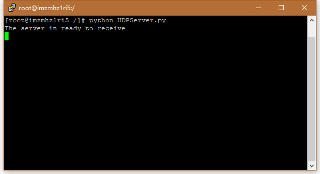
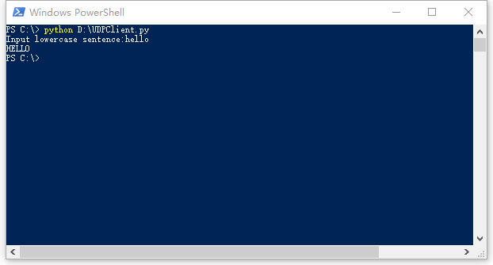

# 2.7.1 UDP套接字编程

### 描述
书中这一节用了一些Python代码来实现一个最简单的UDP通信程序。书中代码基于Python2，本文采用Python3，所以做了一些简单修改。

客户端程序UDPClient.py创建一个UDP套接字，并在用户输入一段小写字母组成的字符串后，发送到指定服务器地址和对应端口，等待服务器返回消息后，将消息显示出来。

服务端程序TCPServer.py一直保持一个可连接的UDP套接字，在接收到字符串后，将其改为大写，然后向客户端返回修改后的字符串。 

### 代码

**UDPClient.py**
```python
from socket import *
serverName = '191.101.232.165' # 服务器地址，本例中使用一台远程主机
serverPort = 12000 # 服务器指定的端口
clientSocket = socket(AF_INET, SOCK_DGRAM) # 创建UDP套接字，使用IPv4协议
message = input('Input lowercase sentence:').encode() # 用户输入信息，并编码为bytes以便发送
clientSocket.sendto(message, (serverName, serverPort)) # 将信息发送到服务器
modifiedMessage, serverAddress = clientSocket.recvfrom(2048) # 从服务器接收信息，同时也能得到服务器地址
print(modifiedMessage.decode()) # 显示服务器返回的信息
clientSocket.close() # 关闭套接字
```


**UDPServer .py**
```python
from socket import *
serverPort = 12000 # 服务器指定的端口
serverSocket = socket(AF_INET, SOCK_DGRAM) # 创建UDP套接字，使用IPv4协议
serverSocket.bind(('',serverPort)) # 将套接字绑定到之前指定的端口
print("The server in ready to receive")
while True: # 服务器将一直接收UDP报文
	message, clientAddress = serverSocket.recvfrom(2048) # 接收客户端信息，同时获得客户端地址
	modifiedMessage = message.upper() # 将客户端发来的字符串变为大写
	serverSocket.sendto(modifiedMessage, clientAddress) # 通过已经获得的客户端地址，将修改后的字符串发回客户端
```

**代码文件：**

[UDPClient.py](source/UDPClient.py)

[UDPServer.py](source/UDPServer.py)


### 运行

先在一台机器上启动服务器程序，然后在另一台机器上启动客户端程序。运行效果如下：

**服务器端：**



**客户端：**



