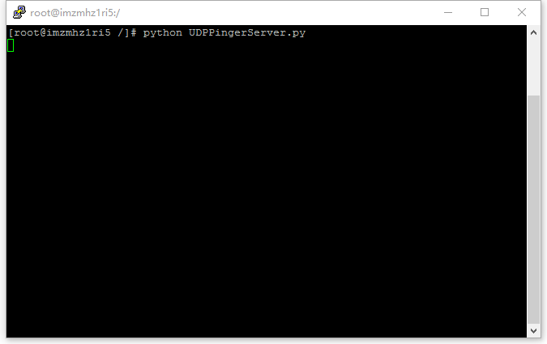

# 编程作业2：UDP- ping程序

### 作业描述

《计算机网络：自顶向下方法》中第二章末尾给出了此编程作业的简单描述：

> 在这个编程作业中，你将用Python编写一个客户ping程序。该客户将发送一个简单的ping报文，接受一个从服务器返回的pong报文，并确定从该客户发送ping报文到接收到pong报文为止的时延。该时延称为往返时延（RTT）。由该客户和服务器提供的功能类似于在现代操作系统中可用的标准ping程序，然而，标准的ping使用互联网控制报文协议（ICMP）（我们将在第4章中学习ICMP）。此时我们将创建一个非标准（但简单）的基于UDP的ping程序。
>
> 你的ping程序经UDP向目标服务器发送10个ping报文，对于每个报文，当对应的pong报文返回时，你的客户要确定和打印RTT。因为UDP是一个不可靠协议，由客户发送的分组可能会丢失。为此，客户不能无限期地等待对ping报文的回答。客户等待服务器回答的时间至多为1秒；如果没有收到回答，客户假定该分组丢失并相应地打印一条报文。
>
> 在此作业中，我们给出服务器的完整代码（在配套网站中可以找到。你的任务是编写客户代码，该代码与服务器代码非常类似。建议你先仔细学习服务器的代码，然后编写你的客户代码，可以不受限制地从服务器代码中剪贴代码行。

### 详细描述

官方给出了该作业的详细文档：[Socket2_UDPpinger.pdf](assignment/Socket2_UDPpinger.pdf)

以下为文件内容翻译：

> #### 套接字编程作业2：UDP ping 程序
>
> 在本实验中，您将学习使用Python进行UDP套接字编程的基础知识。您将学习如何使用UDP套接字发送和接收数据报，以及如何设置适当的套接字超时。在实验中，您将熟悉Ping应用程序及其在计算统计信息（如丢包率）中的作用。
>
> 您首先需要研究一个用Python编写的简单的ping服务器程序，并实现对应的客户端程序。这些程序提供的功能类似于现代操作系统中可用的标准ping程序功能。然而，我们的程序使用更简单的UDP协议，而不是标准互联网控制消息协议（ICMP）来进行通信。 ping协议允许客户端机器发送一个数据包到远程机器，并使远程机器将数据包返回到客户（称为回显）的操作。另外，ping协议允许主机计算它到其他机器的往返时间。
>
> 以下是Ping服务器程序的完整代码。你的任务是写出Ping客户端程序。
>
> ##### 服务器代码
>
> 以下代码完整实现了一个ping服务器。您需要在运行客户端程序之前编译并运行此代码。*而且您不需要修改此代码。*
>
> 在这个服务器代码中，30％的客户端的数据包会被模拟丢失。你应该仔细研究这个代码，它将帮助你编写ping客户端。
>
> ``` python
> # UDPPingerServer.py 
> # We will need the following module to generate randomized lost packets import random 
> from socket import * 
>
> # Create a UDP socket  
> # Notice the use of SOCK_DGRAM for UDP packets 
> serverSocket = socket(AF_INET, SOCK_DGRAM) 
> # Assign IP address and port number to socket 
> serverSocket.bind(('', 12000)) 
>
> while True:     
> 	# Generate random number in the range of 0 to 10 
> 	rand = random.randint(0, 10)     
> 	# Receive the client packet along with the address it is coming from  
> 	message, address = serverSocket.recvfrom(1024) 
> 	# Capitalize the message from the client     
> 	message = message.upper() 
> 	# If rand is less is than 4, we consider the packet lost and do not respond     
> 	if rand < 4:         
> 		continue     
> 	# Otherwise, the server responds         
> 	serverSocket.sendto(message, address) 
> ```
>
> 服务器程序在一个无限循环中监听到来的UDP数据包。当数据包到达时，如果生成一个随机整数大于或等于4，则服务器将数字转为大写并将其发送回客户端。
>
> ##### 数据包丢失
>
> UDP为应用程序提供了不可靠的传输服务。消息可能因为路由器队列溢出，硬件错误或其他原因，而在网络中丢失。但由于在内网中很丢包甚至不丢包，所以在本实验室的服务器程序添加人为损失来模拟网络丢包的影响。服务器创建一个随机整数，由它确定传入的数据包是否丢失。
>
> ##### 客户端代码
>
> 您需要实现以下客户端程序。
>
> 客户端向服务器发送10次ping。因为UDP是不可靠的协议，所以从客户端发送到服务器的数据包可能在网络中丢失。因此，客户端不能无限期地等待ping消息的回复。客户等待服务器回答的时间至多为一秒，如果在一秒内没有收到回复，您的客户端程序应该假定数据包在网络传输期间丢失。您需要查找Python文档，以了解如何在数据报套接字上设置超时值。
>
> 具体来说，您的客户端程序应该
>
> 1. 使用UDP发送ping消息（注意：不同于TCP，您不需要首先建立连接，因为UDP是无连接协议。）
> 2. 从服务器输出响应消息
> 3. 如果从服务器受到响应，则计算并输出每个数据包的往返时延（RTT）（以秒为单位），
> 4. 否则输出“请求超时”
>
> 在开发过程中，您应该先在计算机上运行`UDPPingerServer.py`，并通过向`localhost`（或127.0.0.1）发送数据包来测试客户端。调试完成代码后，您应该能看到ping服务器和ping客户端在不同机器上通过网络进行通信。
>
> ##### 消息格式
>
> 本实验中的ping消息格式使用最简单的方式。客户端消息只有一行，由以下格式的ASCII字符组成：
>
> ​	*Ping sequence_number time*
>
> 其中*sequence_number*从1开始，一直到10，共10条消息，而*time*则是客户端发送消息时的时间。


### 代码
**UDPPinger.py**

```python
from socket import *
import time

serverName = '191.101.232.165' # 服务器地址，本例中使用一台远程主机
serverPort = 12000 # 服务器指定的端口
clientSocket = socket(AF_INET, SOCK_DGRAM) # 创建UDP套接字，使用IPv4协议
clientSocket.settimeout(1) # 设置套接字超时值1秒

for i in range(0, 10):
	sendTime = time.time()
	message = ('Ping %d %s' % (i+1, sendTime)).encode() # 生成数据报，编码为bytes以便发送
	try:
		clientSocket.sendto(message, (serverName, serverPort)) # 将信息发送到服务器
		modifiedMessage, serverAddress = clientSocket.recvfrom(1024) # 从服务器接收信息，同时也能得到服务器地址
		rtt = time.time() - sendTime # 计算往返时间
		print('Sequence %d: Reply from %s    RTT = %.3fs' % (i+1, serverName, rtt)) # 显示信息
	except Exception as e:
		print('Sequence %d: Request timed out' % (i+1))
		
clientSocket.close() # 关闭套接字
```

**UDPPingerServer.py**

```python
# UDPPingerServer.py
# We will need the following module to generate randomized lost packets import random
from socket import *
import random

# Create a UDP socket
# Notice the use of SOCK_DGRAM for UDP packets
serverSocket = socket(AF_INET, SOCK_DGRAM)
# Assign IP address and port number to socket
serverSocket.bind(('', 12000))

while True:
	# Generate random number in the range of 0 to 10
	rand = random.randint(0, 10)
	# Receive the client packet along with the address it is coming from
	message, address = serverSocket.recvfrom(1024)
	# Capitalize the message from the client
	message = message.upper()
	# If rand is less is than 4, we consider the packet lost and do not respond
	if rand < 4:
		continue
	# Otherwise, the server responds
	serverSocket.sendto(message, address)
```

**代码文件**

[UDPPinger.py](source/UDPPinger.py)

[UDPPingerServer.py](source/UDPPingerServer.py)

##### 运行

**服务器端：**

在一台主机上运行`UDPPingerServer.py`，作为接收ping程序数据的服务器。

效果如下：



**客户端：**

在另一台主机上运行`UDPPinger.py`，效果如下：

